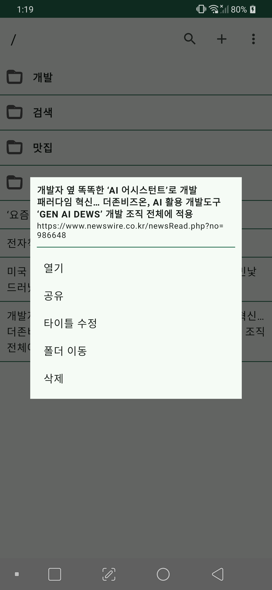

### 지상훈 - 포트폴리오
- Email: zn_mail@naver.com
- GitHub: github.com/znc-kr

---
- 
- UI/UX 최적화와 성능 개선에 관심이 많으며, Jetpack Compose 및 최신 Android 기술을 활용한 앱 개발 경험이 있습니다.  
- 효율적인 코드 작성과 유지보수성을 고려한 개발을 지향합니다.

---
- Skill
  - Kotlin, Java, Python 
  - AAC
  - Jetpack
    - Compose, WorkManager, Camera, Navigation 
  - Coroutine, Flow
  - Hilt, Dagger
  - MVC, MVVM, MVP, MVI
  - Retrofit, OkHttp, Volley
  - SQLite, Room, MongoDB
  - Firebase
  - Flutter, Dart
  - Python, FastAPI
  - Docker

---

### 목차
* [회사 프로젝트](#회사-프로젝트)
* [개인 프로젝트](#개인-프로젝트)

---

## 회사 프로젝트
>[롯데온](https://play.google.com/store/apps/details?id=com.lotte),
[롯데마트몰](https://play.google.com/store/apps/details?id=com.lottemart.shopping),
[롯데백화점몰](https://play.google.com/store/apps/details?id=com.lotte.ellotte),
[토이저러스몰](https://play.google.com/store/apps/details?id=com.lottemart.toysrus)
> - 롯데쇼핑 이커머스앱(롯데온, 롯데백화점몰, 롯데마트몰, 토이저러스) 운영
> - 기간 : 2021.06 ~ now
> - 개발 환경 : Android Studio, Kotlin, GitLab, Jenkins, Jira, Docker, Slack 등
> - 사용 기술 : Retrofit, Glide, Room, WorkManager, Paging3, Coroutine, Flow, Compose, Coil 등
> - 담당 업무 : 서비스 운영, 신규 기능 개발 등
>   - 소스 리팩토링 (메인 구조 리팩토링, 뷰바인딩, 코드 개선 등)
>   - 신규 기능 개발
>     - 프리로드 : 무중단 서비스, 서버 장애 의존성이 감소, 성능 개선
>     - 엘스탬프 : v1(하이브리드)/v2(네이티브) 개발 
>     - 서브탭, 코치마크, 다수 모듈 개발
> - 신규 기술 도입
>     - Coroutine
>       - RxJava -> Coroutine
>     - Compose
>       - 엘스탬프, 서브헤더, 마이롯데, 검색 페이지 등
>     - WorkManager
>       - 비동기 데이터 다운로드
>     - CameraX
>       - 카드 인식 기능 개선
>   - 앱 접근성 적용
>   - 안드로이드 스튜디오 플러그인 개발
>     - 앱 삭제, 데이터 삭제 기능
>   - 데브옵스 페이지 구축 운영
>     - Docker, Jenkins, Python, FastAPI, MongoDB 이용
>     - 모듈 찾기 기능
>     - 빌드, 배포, 알림 자동화
> - Google Play : [롯데온](https://play.google.com/store/apps/details?id=com.lotte),
[롯데마트몰](https://play.google.com/store/apps/details?id=com.lottemart.shopping),
[롯데백화점몰](https://play.google.com/store/apps/details?id=com.lotte.ellotte),
[토이저러스몰](https://play.google.com/store/apps/details?id=com.lottemart.toysrus)  

---

>[라스트오더](https://play.google.com/store/apps/details?id=com.myro.lastorder)
>- 마감할인 쇼핑몰 사용자 애플리케이션
>- 개발 기간 : 2020.03 ~ now
>- 개발 환경 : Kotlin, Android Studio, GitHub
>- 사용 기술 : Retrofit, Glide, Coroutine
>- 담당 업무 : 기존 앱 운영, 신규 앱 개발,운영
>    - 기존 앱 유지보수 (2020.03 ~ 2020.10)
>    - 신규 앱 개발, 운영 (2020.08 ~ 2021.05)
>        - 하이브리드 
>        - 회원가입, 로그인, 장바구니, 주문, 결제 페이지 및 기능 개발
>        - WebView 인터페이스 연동 개발
>- Google Play : [라스트오더](https://play.google.com/store/apps/details?id=com.myro.lastorder)  

---

>라스트오더 점포용 ([일반점포](https://play.google.com/store/apps/details?id=kr.co.lastorder.store), [K7](https://play.google.com/store/apps/details?id=kr.co.lastorder.store.se), [CU](https://play.google.com/store/apps/details?id=kr.co.lastorder.store.cu))
>- 마감 할인 쇼핑몰 관리자 애플리케이션
>- 개발 기간 : 2020.03 ~ 2020.08
>- 개발 환경 : Kotlin, Android Studio, GitHub
>- 사용 기술 : Retrofit, Glide, Room, Zxing, MQTT
>- 담당 업무 : 신규 앱 개발, 운영
>    - 판매 상품관리(등록, 수정), 주문관리(접수, 취소, 완료), 기타 관리(매출, 점포정보 등) 등 
>    - 원소스 멀티앱 (productFlavors 활용, 3개 앱 출시) 
>- Google Play
>    - [라스트오더 사장님용](https://play.google.com/store/apps/details?id=kr.co.lastorder.store)
>    - [라스트오더 K7점포용](https://play.google.com/store/apps/details?id=kr.co.lastorder.store.se)
>    - [라스트오더 CU점포용](https://play.google.com/store/apps/details?id=kr.co.lastorder.store.cu)

---

>[패시키](https://play.google.com/store/apps/details?id=com.rowem.passikey.app)
>- 통합 인증 플랫폼 (보안 로그인)
>    - 비밀번호 4자리 이용한 서비스 이용(제휴사 연동)
>- 개발 기간 : 2019.02 ~ 2019.08
>- 개발 환경 : Kotlin, Android Studio, GitLab
>- 사용 기술 : Retrofit, Glide, Room, Aes-256, SHA-512, Zxing
>- 담당 업무 : 신규 솔루션 개발
>    - 회원가입, 로그인, 핀패드, 제휴사 가입/로그인, 암호화 모듈, 생체 인식 기능 등
>- Google Play : [패시키](https://play.google.com/store/apps/details?id=com.rowem.passikey.app)

---

>[스타패스](https://play.google.com/store/apps/details?id=inc.rowem.passicon)
>- 아이돌 팬덤 플랫폼
>- 개발 기간 : 2018.03 ~ 2018.08
>- 개발 환경 : Java, Android Studio, GitLab 
>- 사용 기술 : Retrofit, Glide, Firebase, OAuth(Google, Kakao, WeChat), Tapjoy, Admob
>- 담당 업무 : 신규 서비스 개발, 운영
>    - 소셜로그인, 랭킹, 포인트, 광고(애드몹, 탭조이), 인앱 결제 등
>- Google Play : [스타패스](https://play.google.com/store/apps/details?id=inc.rowem.passicon)

---

>[네트워크OnS](https://play.google.com/store/apps/details?id=com.eksys.networkons)
>- 차량 관제 애플리케이션
>   - 법인 차량 관제 애플리케이션 (SK오앤에스)
>- 개발 기간 : 2017.04 ~ 2017.08
>- 개발 환경 : Java, Android Studio, SVN
>- 사용 기술 : BLE(Beacon), Volley, SQLite
>- 담당 업무 : 신규 앱 개발
>    - 비콘 연동 (로그인, 배터리), 궤적 데이터 전송, 네비게이션 외 메뉴 기능 개발
>- Google Play : [네트워크OnS](https://play.google.com/store/apps/details?id=com.eksys.networkons)

---

>비콘 매니저
>- Locus O2O 관리자 애플리케이션 (비콘 관리 애플리케이션)
>   - 자사 솔루션에 사용되는 비콘 관리 애플리케이션
>   - 가상 지역에 비콘 매핑
>- 개발 기간 : 2015.09 ~ 2015.12
>- 개발 환경 : Java, Android Studio, SVN
>- 사용 기술 : Java, GitHub, Volley, BLE(Beacon), 비콘 제조사 SDK 연동
>- 담당 업무 : 서비스 유지 보수
>    - 신규 비콘 연동, 서비스 안정화

---

>그외
>- 모플라이(모바일 쇼핑몰 앱 연동 서비스) (2016.02 ~ 2016.10)
>- 광고 노출 SDK (광고 서비스 SDK) (2016.07 ~ 2016.10)
>- 상태바 상주 광고 SDK (광고 서비스 SDK) (2016.03 ~ 2016.10)
>- T멤버십 애플리케이션 개발 (2014.11 ~ 2015.07)
>- 식단 정보 제공 애플리케이션 개발 (2014.06 ~ 2014.10)
>- 보안 카드 관리 애플리케이션 개발 (2013.11 ~ 2014.05)
>- 쿠폰 서비스 애플리케이션 개발 (2013.04 ~ 2013.10)
>- 신한카드 스마트월렛 애플리케이션 개발 (2012.03 ~ 2013.03)
>- 민트마켓 (중고거래 서비스) 애플리케이션 개발 (2011.12 ~ 2012.02)
>- 한국전기안전공사 모바일 오피스 애플리케이션 개발 (2011.10 ~ 2011.12)
>- Android 2.2 애플리케이션 포팅 (패드) (2010.12 ~ 2011.02)
>- Android 2.1 애플리케이션 포팅 (모바일) (2010.06 ~ 2011.05)

---

## 개인 프로젝트

> 웹갈피 (가칭, 오픈 준비 중)
- 웹 북마크 관리 애플리케이션
>    - 간단한 북마크 저장과 검색을 위해 개발
>    - 트리 구조 (폴더와 북마크 아이템으로 구성)
>    - Only Compose
- 개발 기간 : 2023.01 ~
- 개발 환경 : Kotlin, Android Studio, GitHub
- 사용 기술 : Hilt, Compose(Navigation), Room

---

> [비번관리](https://play.google.com/store/apps/details?id=kr.znc.app.znpasswordmanager)
- 비밀번호 관리 애플리케이션
>    - 앱에서 직접 연동보다는, 관리의 목적으로 개발
>    - 사용자 설정한 암호 기반으로 키 생성 (SHA-512)
>    - 대상 데이터 암복호화 (AES-256)
>    - 비밀번호 임의 생성 기능 (대소문자, 특수문자, 숫자, 자릿수 선택 가능)
>    - 사용자 암호 변경 가능
>    - 클립보드 이용한 데이터 백업, 복원
- 개발 기간 : 2017.11 ~ 2017.12
- 개발 환경 : Java(-> Kotlin), Android Studio, GitHub
- 사용 기술 : AES-256, SHA-512, SQLite
- Google Play : [비번관리](https://play.google.com/store/apps/details?id=kr.znc.app.znpasswordmanager)

---

> [노티메모](https://play.google.com/store/apps/details?id=kr.znc.app.sendnoti)
>- 노티 영역에 작성한 메모 노출
   >    - 제목, 내용의 간단한 메모를 작성하여 알림 영역에 노출
>    - 알림 영역에서 수정, 삭제, 공유 기능 지원
>    - 복원 기능 (폰재부팅, 앱종료 등)
>- 개발 기간 : 2019.04 ~ 2019.04
>- 개발 환경 : Kotlin, Android Studio, GitHub
>- Google Play :[노티메모](https://play.google.com/store/apps/details?id=kr.znc.app.sendnoti)

---

> [소리타일](https://play.google.com/store/apps/details?id=kr.znc.app.qstile.volume)
>- Quick Settings(알람패널)에 볼륨 설정 기능 오픈하는 타일 추가
>- 개발 기간 : 2021.01 ~ 2021.01
>- 개발 환경 : Kotlin, Android Studio, GitHub
>- Google Play : [소리타일](https://play.google.com/store/apps/details?id=kr.znc.app.qstile.volume)

---

> 메가찬스 텔레그램 봇
>- 메가박스 특정 상품 업데이트시, 텔레그램으로 메시지 전송
>    - 메가박스 홈페이지의 메가찬스 상품(영화 1+1) - 파이썬 이용 크롤링
>    - 텔레그램 봇을 통한 알림 처리
>- 개발 기간 : 2019.01 ~ 2019.02
>- 개발 환경 : Python3, Linux(CentOS 8)

---

